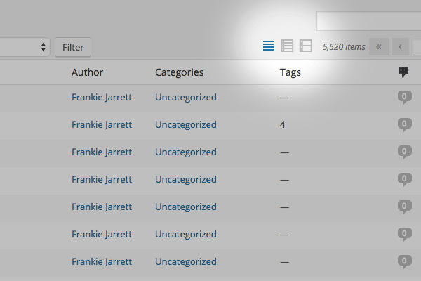

<!-- DO NOT EDIT THIS FILE; it is auto-generated from readme.txt -->
# Compact View Mode

View your post list in a more precise and compact way.

**Contributors:** [fjarrett](https://profiles.wordpress.org/fjarrett)  
**Tags:** [admin](https://wordpress.org/plugins/tags/admin), [posts](https://wordpress.org/plugins/tags/posts)  
**Requires at least:** 4.0  
**Tested up to:** 4.5  
**Stable tag:** 0.4.0  
**License:** [GPLv2 or later](http://www.gnu.org/licenses/gpl-2.0.html)  

 

## Description ##

**Did you find this plugin helpful? Please consider [leaving a 5-star review](https://wordpress.org/support/view/plugin-reviews/compact-view-mode).**

Are you a minimalist? This plugin is for you.

WordPress comes with List and Excerpt view modes by default.

This plugin adds a third mode called Compact, which allows you to fit more posts on the screen without scrolling.

**Development of this plugin is done [on GitHub](https://github.com/fjarrett/compact-view-mode). Pull requests welcome. Please see [issues reported](https://github.com/fjarrett/compact-view-mode/issues) there before going to the plugin forum.**

## Screenshots ##

### Click the first icon to enable compact view mode.

## Changelog ##

### 0.4.0 - April 13, 2016 ###
* New: Indicate support for WordPress 4.5.
* New: Taxonomies compacted into bubbles like comments.
* Fix: Compatibility issue introduced in WordPress 4.4.

Props [fjarrett](https://github.com/fjarrett)

### 0.3.1 - February 18, 2015 ###
* Fix: Bug causing other post types to be affected by compact view.

Props [fjarrett](https://github.com/fjarrett)

### 0.3.0 - February 18, 2015 ###
* New: Add support for compacting the Categories column.
* Tweak: Properly compact columns when cancelling Quick Edit mode.
* Tweak: Adjust the Author, Categories and Tags column widths.

Props [fjarrett](https://github.com/fjarrett)

### 0.2.0 - February 18, 2015 ###
* New: Special column compatibility for WordPress SEO by Yoast plugin.
* Tweak: Automatically hide extra columns when compact mode is enabled.
* Fix: Column duplication bug when cancelling Quick Edit mode.

Props [fjarrett](https://github.com/fjarrett)

### 0.1.0 - January 7, 2015 ###
* Initial release.

Props [fjarrett](https://github.com/fjarrett)

